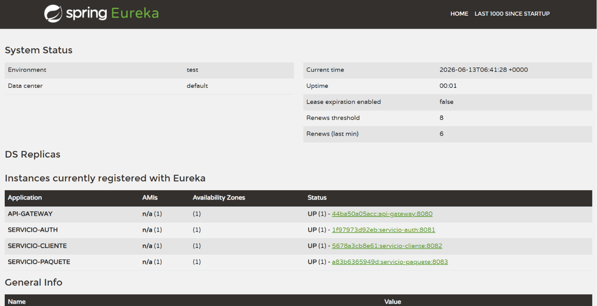

# RapidoCourier - Plataforma Backend de Microservicios

Este repositorio contiene la implementación del backend para **RapidoCourier S.A.C.**, diseñado bajo una arquitectura distribuida de microservicios utilizando Spring Boot 3.x, Java 17 y Spring Cloud.

---

## 1. Mapa de Microservicios y Bounded Contexts

El ecosistema está compuesto por los siguientes servicios:

### Servicios de Infraestructura
- **eureka-server (Puerto 8761)**: Servidor de descubrimiento para registro y localización de microservicios.
- **config-server (Puerto 8888)**: Servidor de configuración externalizada centralizada basada en un repositorio Git local.
- **api-gateway (Puerto 8080)**: Punto de entrada único. Gestiona el balanceo de carga (`spring-cloud-loadbalancer`), trazabilidad y **seguridad JWT centralizada**.
  *Nota: Las rutas dinámicas del gateway se configuran en el Config Server y se cargan al iniciar.*

### Servicios de Negocio y Datos
| Microservicio | Bounded Context | Entidades JPA | RF Cubiertos | Base de Datos | Tipo de Comunicación |
|---|---|---|---|---|---|
| **servicio-auth** | Identidad y Accesos | `Usuario` | RF-08 (Registro, login y roles) | PostgreSQL (`auth_db`) | Síncrona (Downstream JWT) |
| **servicio-cliente** | Gestión de Clientes | `Cliente` (Auditada) | RF-01, RF-02 (RENIEC, duplicidad) | PostgreSQL (`cliente_db`) | Síncrona (Feign) |
| **servicio-paquete** | Envíos y Distribución | `Paquete` (Auditada), `HistorialEstado`, `Categoria` | RF-03, RF-04, RF-05, RF-06, RF-07, RF-09 (Tarifa, estados, historial, búsqueda, categorías) | PostgreSQL (`paquete_db`) | Síncrona (Feign + Resilience4j CB/Retry) |

### Diagrama de Dependencias y Comunicación
```
               [ Cliente / API Consumer ]
                           │
                           ▼
                     [ api-gateway ] (JWT Auth Filter / Roles)
                           │
         ┌─────────────────┼─────────────────┐
         ▼                 ▼                 ▼
  [ servicio-auth ] [ servicio-cliente ] [ servicio-paquete ]
                           ▲                 │ (Feign + CB + Retry)
                           └─────────────────┘
```

---

## 2. Modelos de Datos por Servicio

### Bounded Context: Identidad y Accesos (servicio-auth)
- **Entidad `Usuario`**:
  - `id` (UUID, PK)
  - `email` (String, Unique, Not Null)
  - `password` (String, Not Null)
  - `rol` (RolNombre: `ROLE_ADMIN`, `ROLE_OPERADOR`, `ROLE_CLIENTE`, Not Null)

### Bounded Context: Clientes (servicio-cliente)
- **Entidad `Cliente`**:
  - `id` (UUID, PK)
  - `dni` (String, Unique, Length=8)
  - `nombre` (String)
  - `apellidoPaterno` (String)
  - `apellidoMaterno` (String)
  - `email` (String, Unique)
  - `telefono` (String)
  - `createdAt` (LocalDateTime, Auditoría automática `@CreationTimestamp`)
  - `updatedAt` (LocalDateTime, Auditoría automática `@UpdateTimestamp`)

### Bounded Context: Envíos (servicio-paquete)
- **Entidad `Paquete`**:
  - `id` (UUID, PK)
  - `codigoRastreo` (String, Unique)
  - `dniRemitente` (String)
  - `dniDestinatario` (String)
  - `pesoKg` (Double)
  - `valorDeclarado` (BigDecimal)
  - `tarifa` (BigDecimal)
  - `sucursalOrigen` (String)
  - `sucursalDestino` (String)
  - `estadoActual` (String)
  - `descripcion` (String)
  - `createdAt` (LocalDateTime, Auditoría automática `@CreationTimestamp`)
  - `updatedAt` (LocalDateTime, Auditoría automática `@UpdateTimestamp`)
  - *Relaciones:*
    - `@OneToMany` -> `HistorialEstado` (Cascada completa)
    - `@ManyToMany` -> `Categoria` (Mediante tabla intermedia `paquete_categoria`)

- **Entidad `HistorialEstado`**:
  - `id` (UUID, PK)
  - `estadoAnterior` (String)
  - `estadoNuevo` (String)
  - `fechaCambio` (LocalDateTime)
  - `usuarioResponsable` (String, Email del operador inyectado por cabecera)
  - `@ManyToOne` -> `Paquete`

- **Entidad `Categoria`**:
  - `id` (UUID, PK)
  - `nombre` (String, Unique)

---

## 3. Justificación Arquitectónica de la Descomposición (Sección 3)

Se ha diseñado una arquitectura distribuida basada en microservicios para resolver el dominio de RapidoCourier bajo el principio de Bounded Contexts de DDD. La separación física de servicios (servicio-auth, servicio-cliente y servicio-paquete) permite escalar y desplegar de manera independiente cada dominio, protegiendo la base de datos de cada uno (Database-per-Service) y reduciendo el radio de impacto de fallos. La comunicación síncrona se realiza mediante Feign Clients de manera controlada de cara al usuario, implementando patrones de tolerancia a fallos como Circuit Breaker y Retry de Resilience4j, los cuales impiden que la indisponibilidad de dependencias secundarias (como servicio-cliente) bloquee las operaciones críticas de negocio en servicio-paquete (registro de envíos). El API Gateway centraliza la validación de tokens JWT distribuyendo los roles sin sobrecargar la red interna. La consistencia de datos entre servicios se mantiene de forma eventual en consultas generales a través de Feign y fallback degradado con resiliencia, lo cual soluciona la decisión difícil de acoplar o no los esquemas de base de datos a nivel físico, optando por mantener el desacoplamiento lógico e integridad autónoma.

---

## 4. Lógica de Negocio y Reglas

### Cálculo de Tarifa Dinámico (RF-03)
La tarifa del paquete se calcula automáticamente durante el registro basándose en las variables de peso y valor declarado:
$$\text{Tarifa} = \text{Precio Base} + (\text{Peso en kg} \times \text{Factor de Peso}) + (2\% \text{ del Valor Declarado})$$
*Nota: El **Precio Base** (por defecto S/ 10.00) y el **Factor de Peso** (por defecto S/ 5.00) son cargados en caliente mediante Config Server y `@RefreshScope`.*

### Máquina de Estados y Transiciones (RF-04)
Los estados permitidos del paquete y sus transiciones válidas son:
- **REGISTRADO**: Estado inicial al crearse el paquete.
  - *Transición permitida:* Únicamente a **EN_TRANSITO**.
- **EN_TRANSITO**: Paquete en camino a la sucursal de destino.
  - *Transición permitida:* Únicamente a **ENTREGADO**.
- **ENTREGADO**: Estado final del paquete. No se permiten más transiciones.

Cualquier transición fuera de esta secuencia definida es rechazada con un código `409 Conflict` y un mensaje descriptivo de la secuencia inválida. El historial de estados devuelto figura siempre ordenado ascendentemente por su fecha de cambio.

---

## 5. Seguridad JWT Centralizada y Roles (RF-08)

El control de accesos se realiza de manera centralizada en el **api-gateway** mediante un filtro personalizado (`JwtAuthFilter`). Este filtro valida la firma del token emitido por `servicio-auth` y aplica las siguientes reglas de autorización:
- **ROLE_ADMIN**: Autorizado a realizar operaciones de escritura y lectura, y el único rol con acceso a borrar recursos (`DELETE`).
- **ROLE_OPERADOR**: Autorizado a realizar escrituras, modificaciones y consultas (métodos `POST`, `PUT`, `PATCH`, `GET`). No tiene acceso a `DELETE`.
- **ROLE_CLIENTE**: Únicamente puede consultar información (`GET`). Su acceso está estrictamente restringido a sus propios paquetes e historial de estados (el DNI del cliente autenticado debe coincidir con el DNI del remitente o del destinatario en el paquete).

Una vez validado el token, el Gateway inyecta las cabeceras `X-User-Email` y `X-User-Role` en la petición downstream hacia los microservicios, lo que permite auditar qué usuario realiza cada acción y validar la propiedad en el microservicio de paquetes.

---

## 6. Resiliencia, Configuración y Actuator

### Circuit Breaker y Retry (Sección 15)
El microservicio `servicio-paquete` consume de forma síncrona a `servicio-cliente` usando Feign. Para tolerar fallos, se aplica un `@CircuitBreaker` (`clienteCB`) y `@Retry` (`clienteRetry`) con backoff exponencial. Si el servicio de clientes no está disponible, el sistema permite registrar el paquete registrando la advertencia y completando la transacción de forma degradada. Se ha desacoplado la lógica de resiliencia en un bean separado (`ClienteLookupService`) para evitar problemas de auto-invocación y asegurar que Spring AOP active los proxies.

### Recarga en Caliente de Propiedades (Sección 13)
Se utiliza `@RefreshScope` en las propiedades críticas. El comando para recargar la configuración del servicio de paquetes tras actualizar el repositorio de Config Server es:
```bash
curl -i -X POST http://localhost:8083/actuator/refresh
```

---

## 7. Instrucciones para levantar el Entorno Local

1. **Requisitos**: Java 17 o superior y Maven configurado.
2. **Levantamiento paso a paso** (esperar que cada componente esté arriba antes de iniciar el siguiente):
   - **Paso 1**: Levantar `eureka-server` (`mvn spring-boot:run`).
   - **Paso 2**: Levantar `config-server` (`mvn spring-boot:run`).
   - **Paso 3**: Levantar `api-gateway` (`mvn spring-boot:run`).
   - **Paso 4**: Levantar los microservicios de negocio `servicio-auth`, `servicio-cliente` y `servicio-paquete` (`mvn spring-boot:run`).
3. Comprobar que todos los servicios figuren en estado `UP` en el dashboard de Eureka (`http://localhost:8761`).

> **Evidencia Eureka**: Una vez levantados todos los servicios, el dashboard de Eureka en `http://localhost:8761` debe mostrar los servicios `SERVICIO-AUTH`, `SERVICIO-CLIENTE`, `SERVICIO-PAQUETE` y `API-GATEWAY` en estado `UP`.
> 

---

## 8. Rutas del API Gateway (Puerto 8080)

Todas las peticiones externas pasan por el API Gateway en `http://localhost:8080`. Las rutas configuradas son:

| Ruta | Destino | Descripción |
|---|---|---|
| `/api/v1/auth/**` | `servicio-auth` | Registro y login de usuarios |
| `/api/v1/clientes/**` | `servicio-cliente` | CRUD de clientes (con validación RENIEC) |
| `/api/v1/paquetes/**` | `servicio-paquete` | CRUD de paquetes, estados e historial |
| `/api/v1/categorias/**` | `servicio-paquete` | CRUD de categorías de paquetes |

---

## 9. Ejemplos de Uso (curl)

> Reemplaza `<TOKEN>` por el JWT obtenido del endpoint de login.

### Categorías

**Listar todas las categorías:**
```bash
curl -s http://localhost:8080/api/v1/categorias \
  -H "Authorization: Bearer <TOKEN>"
```

**Crear una categoría:**
```bash
curl -s -X POST http://localhost:8080/api/v1/categorias \
  -H "Authorization: Bearer <TOKEN>" \
  -H "Content-Type: application/json" \
  -d '{"nombre": "ELECTRONICO"}'
```

**Asignar categoría a un paquete:**
```bash
curl -s -X POST http://localhost:8080/api/v1/paquetes/{paqueteId}/categorias/{categoriaId} \
  -H "Authorization: Bearer <TOKEN>"
```

### Actuator y Resiliencia

**Verificar estado del Circuit Breaker `clienteCB`:**
```bash
curl -s http://localhost:8083/actuator/circuitbreakers
```
Salida esperada (ejemplo):
```json
{
  "circuitBreakers": {
    "clienteCB": {
      "failureRate": "-1.0%",
      "slowCallRate": "-1.0%",
      "state": "CLOSED",
      "bufferedCalls": 0,
      "failedCalls": 0,
      "slowCalls": 0,
      "slowFailedCalls": 0,
      "notPermittedCalls": 0
    }
  }
}
```

**Recargar configuración en caliente (tras actualizar Config Server):**
```bash
curl -i -X POST http://localhost:8083/actuator/refresh
```

### Paquetes

**Registrar un paquete:**
```bash
curl -s -X POST http://localhost:8080/api/v1/paquetes \
  -H "Authorization: Bearer <TOKEN>" \
  -H "Content-Type: application/json" \
  -d '{"dniRemitente":"12345678","dniDestinatario":"87654321","pesoKg":2.5,"valorDeclarado":150.00,"sucursalOrigen":"Lima","sucursalDestino":"Arequipa"}'
```

**Rastrear paquete por código:**
```bash
curl -s http://localhost:8080/api/v1/paquetes/rastreo/RC-XXXXXXXX \
  -H "Authorization: Bearer <TOKEN>"
```

